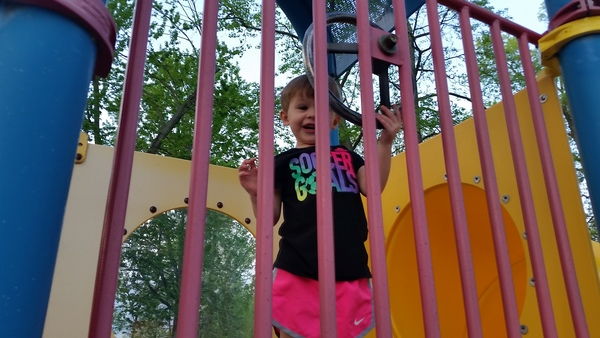

---
title: The Walk 
author: Grandpa Bill 
publisher: Me2You
rights: © 2019 Bill Uhlarik 
cover-image: cover.jpg
...

***

## At the Beginning

* How many people can you see?

* Who is leading the group?

* Who is at the end of the group?

* Who is running?

##

* Who is this?

* How many balloons are on her blouse?

* What color are the balloons?

##

* Who is on the left?

* Who is on the right?

* How many people do you see?

* Who is wearing blue?

##The Benches

* Who is behind the bench?

* Who is not looking at the camera?

* Who is not smiling?

* Who has writing on their shirts?

##

* Who just showed up?

* Now who is not looking at the camera?

* Who is on the left?

* Who is wearing a hat?

* Whose outfit matches the frisbee?

##

* Wow! Now who showed up?

* What is missing from the previous picture?

* How many people are in the picture?

##

* How many people are on the bench?

* Who is on the left?

* Who is on the right?

* Who has a frisbee?

##

* Who is waving?

* Who is behind the bench?

* Who is on the right?

* Who is not looking at the camera?

##

* Who is in the center of the bench?
 
* Who is holding the frisbee?

* Who is sitting next to Maria?

* Who is sitting next to Anessa?

##

* Who showed up?

* Who has an itch?

* Who is not paying attention?

* How many people have their legs crossed?

* How many shirts have writing on them?

##

* Who is hiding from the camera?

* Who has the biggest pout?

##

* Who\'s feet are not touching the ground?

* Who is not looking at the camera?

* How many people are on the bench?

* Where is everyone else?

##

* Why aren\'t we sitting on the bench?????

* How many people are sitting on the ground?

* Who is not looking at the camera?

##

* Who do you see in the back?

* Who is in the stroller?

* What\'s wrong with the bench?????

##

* What does Elijah\'s shirt say?

* What does Emma\'s shirt say?

##

* What does Isaiah's shirt say?

* What does Maria's shirt say?

##

* Who has the biggest smile?

##

* What is in the back?

* How many people are on the bench?

* Where is everyone else?

* Who has their legs crossed?

* Who is looking at the camera?

##The Wall

* Where did the benches go???

* Who has their hat on backwards?

* Who looks interested in something else?

##Finally, The Park!

* Who is going down the slide?

* Who is going up the slide?

* Where is everyone else?

* How many cars do you see?

##

* Who is going down the slide?

* What colors do you see?

##

* Who is driving?

* What colors do you see?

##

* Who\'s climbing?

* What is this thing called????

* What color are Gianna\'s shoes?

##

* And who is this little man?

* And what is he doing?

* What colors do you see?

##

* And who is this?

* And what is he doing?

##

* Who do you see?

* What do you call this thing?

##

* Who do you see?

##

* Where is the frisbee?

* How many people can you find?

* How many trash cans can you find?

##

* And who do you see?

* What else do you see in this picture?

##

* Who do you see?

* Who is wearing a hat?

* Who is soaring?

##

* What is Emma doing?

* How many people do you see?

* How many people have their legs crossed?

##

* Who is this?

* What is this thing called?

##

* Who is not looking at the camera?

##

* Anyone got a boost?

##

* What does Isaiah\' shirt say?

* Who else do you see?

##

* Who do you see?

* What are they doing?

##

* And who is this?

* What does her shirt say?

* Where is she?
